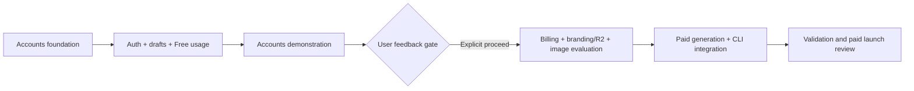

# Accounts, billing, and paid branding implementation handoff

September 14, 2026; status updated September 15. Product decisions accepted through Q28. This is one implementation plan with two consecutive phases and a mandatory feedback gate between them. The owner approved Gate A in `15755bc` after the local accounts review; Phase 2’s initial implementation is `e5f43dd`. Source revision `acbbead79` now has a READY shared Preview and passing CI (837 tests in 67 files plus build), including the approved per-account spending protection and new-card readability safeguard. The recorded sandbox billing lifecycles, development R2 and hosted cancelled-Workflow/Preview DB roundtrip are verified, including exact fixture cleanup. Gate B remains open for hosted access/auth/signed delivery, Workflow durability and operational measurements, supported image quality/cost limits and production readiness. Vercel protection currently blocks anonymous Preview access; its proposed exception was rejected by automatic approval review and awaits user approval. GitHub’s callback and the redeployed sandbox webhook secret are saved; Google setup awaits the owner’s passkey. Shared Preview reuses the existing Neon role and normal environment credentials; the owner accepts `r2.dev` here and deferred a production custom domain. Both paid launch flags remain disabled. Neither phase has been connected, migrated or deployed to production by this rollout. See the [paid review](PAID_REVIEW.md#hosted-preview), [accounts review](ACCOUNTS_REVIEW.md) and [production guide](PRODUCTION.md#accounts-release-readiness) for evidence and remaining checks. The [interview record](research/ACCOUNTS_PAID_BRANDING_DESIGN.md) preserves decision history; this handoff supersedes earlier research recommendations.

## Sequence and stop conditions

| Stage | Deliverable | Exit condition |
| --- | --- | --- |
| Phase 1: accounts | Authentication, ownership, guest carryover, saved drafts, My passages, preference sync, Free summary usage | Working accounts experience, required checks, and a reviewable demonstration |
| **Gate A: accounts feedback** | User reviews the complete accounts experience; incorporate feedback | **Explicit direction to proceed to Phase 2** |
| Phase 2: paid features | Stripe, paid branding/templates/uploads, R2, image benchmark and generation, authenticated CLI/skill | Complete paid experience and validated cost/quality gates |
| Gate B: paid launch | Review the integrated result, measured economics, and production readiness | Resolve failed gates before enabling public paid checkout |

**Gate A was explicitly cleared on September 15; the following sequence remains the agreed implementation contract.**

**The Gate A pause is mandatory. Do not start Phase 2 code, dependencies, migrations, runtime integration, application-managed Stripe products, R2 integration, or the paid image benchmark while Phase 1 is underway or awaiting feedback.** User-led service-account, DNS, bucket and credential preparation may happen now, per the subsequent setup request and [third-party setup checklist](THIRD_PARTY_SETUP.md). This prepares dependencies without starting paid application implementation. The accepted $20 benchmark budget applies after Gate A. Fix accounts feedback before continuing; passing tests or elapsed time is not approval to proceed.

Parallelize bounded work inside a phase, after its shared contracts are fixed. One integrator owns shared database migrations and lifecycle transactions. Do not create independent tasks that bypass the feedback gate.

## Accepted product contract

Normal creation and all available public readers remain accessible without signup. Accounts are individual; authentication is email/password, Google, and GitHub through Better Auth. Retain Next.js/Vercel, Neon PostgreSQL, Drizzle, and the existing renderer. Use standard Stripe integration and Cloudflare R2 for paid assets.

|  | Guest | Free account | Plus | Pro |
| --- | --: | --: | --: | --: |
| Monthly price | $0 | $0 | $10 | $25 |
| Annual price, paid upfront | — | — | $96 | $240 |
| Summary generations per month | 5/browser | 25 | 100 | 300 |
| Image generations per month | 0 | 0 | 10 | 25 |
| Account library and synced curated preferences | — | Yes | Yes | Yes |
| Custom card branding, uploads, saved templates | — | — | Yes | Yes |

Both paid tiers have the same customization features. Annual billing gives exactly 20% off and replenishes allowances monthly; included units do not roll over. The accepted additional image pack is **$10 for 50 standard generations**, explicitly purchased with no automatic overage charge. Consume included monthly image units first. Purchased units do not expire, survive cancellation, and require an active paid subscription to spend. No summary packs for launch.

A generation is a new AI result, including rerolls and unpublished work. Summary and image counters are separate. Cached reuse, manual edits, uploads, rendering, and publishing do not consume generation units. Deleting work does not restore consumed units. A usable but aesthetically unwanted result counts; a confirmed technical failure without a usable result restores the reserved allowance. Uncertain outcomes remain reserved while reconciled.

Free and guest AI share a **$25/month service-wide subsidy**. At its ceiling, stop new uncached free generations, preserving cached work and existing publications. Maintain endpoint/network abuse controls independently of customer allowances. A browser cookie is not proof of a unique person.

Customize social cards only; the reader retains Passage's interface and original-source attribution. Published text, settings, and accepted artwork are fixed. Editing a published passage prepares a new draft and creates a new URL when revised; it never edits an existing URL in place.

Out of scope: teams, collaboration, custom domains/slugs, analytics dashboards, a freeform canvas, uploaded fonts, model training, multiple style-reference inputs, a customer-facing model picker, and public R2 garbage collection. These are not prerequisites for this launch.

## Phase 1 — accounts and related Free functionality

### 1.0 Foundation and migration contract — integrator, first

Inspect the current checkout before editing. Read [contributing](../contributing.md), [testing](testing.md), [production](PRODUCTION.md), and [brand identity](brand-identity.md). Install the pinned dependencies through the existing workflow and read the installed Next.js guides under `node_modules/next/dist/docs/` before writing framework code. Avoid an incidental framework/ORM upgrade.

Add only the Phase 1 schema: Better Auth's generated tables, account preferences, saved drafts, generation operations/usage records, guest-import bookkeeping, and publication ownership. Keep Stripe, templates, assets, image credits, and image-provider tables for Phase 2. Leave narrow extension points without building a general entitlement framework prematurely.

| Contract | Implementation requirement |
| --- | --- |
| Authenticated actor | Resolve the verified server session or a new guest identity at every mutation. Never authorize from a supplied owner ID or cookie presence alone. |
| Shared source/snapshot | Keep the current public capture/cache reuse. Owning a publication does not establish ownership or authorship of its source. |
| Publication owner and dedupe scope | Separate mutable ownership from an immutable deduplication namespace. New account publications dedupe within that account's namespace; new guest publications within the guest namespace. |
| Guest import | Transfer current guest ownership without changing existing URLs or namespaces. Preserve two existing URLs if guest and account already published identical presentations. Future account creation uses the account namespace. |
| Legacy records | Keep existing publication IDs, URLs, and anonymous legacy namespace. They remain unowned. A public URL or old publication token is not an account-ownership claim. |
| Owner deletion | Tombstone the owner's publication without marking the shared source unavailable. Never resurrect a deleted URL through a retry or dedupe lookup; exclude deleted rows from reuse. |
| Saved draft | Persist owner, snapshot, source generation, reviewed text, appearance, optional parent publication, revision, and operation references. Draft lifetime is independent of bearer-token expiry. |
| Generation operation | Persist operation identity, owner, request key, draft/revision, original allowance period, status, result, and provider cost/identity where available. |

Use additive migrations and preserve the old appearance shape and token reader. Backfill legacy namespace metadata without assigning owners or changing URLs. Rehearse migration against a disposable database containing legacy fixtures. One integrator generates and orders migrations; other lanes supply schema requirements rather than conflicting migration files.

### 1.1 Authentication and account settings — parallel lane A

Use Better Auth's Next.js handler, Drizzle PostgreSQL adapter, and anonymous plugin. Establish a guest session on first creation, not on every reader/page visit. Reuse the existing database connection and Drizzle migration workflow. The anonymous plugin supports guest identities, but Passage must implement its own transactional data/usage import. [Better Auth Next.js](https://better-auth.com/docs/integrations/next), [Drizzle adapter](https://better-auth.com/docs/adapters/drizzle), [anonymous plugin](https://better-auth.com/docs/plugins/anonymous).

Build branded signup/sign-in, email verification, password recovery, sign-out, and account settings/deletion. Use existing components and neutral Passage styling. Password registration requires email verification before gaining registered-account benefits; guest creation stays available. Keep verified-email account linking and last-login-method protections; do not add trusted-provider verification bypasses. Session freshness/verification guards sensitive account changes. [Account management](https://better-auth.com/docs/concepts/users-accounts).

Wire transactional delivery through a small sender module. Reuse an existing configured sender if discovered during setup; otherwise use Resend as the implementation default, with a verified sending domain and separate environment credentials. Deliver verification/reset emails reliably on the serverless host; do not log their tokens. [Resend Next.js integration](https://resend.com/docs/send-with-nextjs).

On signup **or login to an existing account**, import the current guest session's drafts, publications, consumed usage, and pending reservations exactly once. Existing account preferences win; the active draft retains its reviewed choices. Imports preserve work even if combined usage exceeds allowance, then block further generation. Signing out never transfers account-owned work into a new guest session. Preserve the guest claim through OAuth redirects and email-verification completion without using a public URL as evidence.

Suggested seams: new `lib/auth.ts`, `lib/auth-client.ts`, and account service; new `/api/auth/[...all]` handler; shared actor resolver used by application services.

### 1.2 Saved drafts, ownership, and My passages — parallel lane B

Extend [drafts](../lib/drafts.ts) and [service](../lib/service.ts), preserving publication lifecycle transactions. Add an account library with Drafts and Published views, resume, revise as a new passage, and delete. Paginate results. Account drafts persist until deletion and remain private. Revising an owned publication copies its exact saved text, resolved design and existing artwork into the new draft without generation charges; it does not adopt newer template/account defaults. Explicit changes create the revised presentation. Paid publication still requires current entitlement. Cross-account forks instead apply the new sharer's permitted defaults.

Autosave reviewed text and curated appearance. Show saving/saved/error state; publish the reviewed revision, not a stale autosave. Use revision checks so concurrent device/tab edits cannot silently overwrite one another. Import local curated preferences for a new account without server preferences; load saved account preferences on returning login. Preserve the existing guest preference behavior.

Add a summary-regeneration action using the existing bounded summary task. The initial shared summary may remain on `snapshots.preview`; explicit rerolls belong to the draft and must not overwrite the shared cache or another user's work. Associate each result with the draft revision that requested it. If the user edits meanwhile, retain the generated result and let them apply it explicitly.

Update `cleanupPreparations()` to protect snapshots referenced by saved drafts and unfinished operations; today it protects only publication references. Retain current source-removal checks when resuming and publishing. A saved draft cannot revive an unavailable source.

Primary UI seams: [share flow](../components/share-flow.tsx), [preview review](../components/preview-review.tsx), [card preferences](../lib/card-preferences.ts), plus new account/library screens. Keep existing card layouts and summary instructions unless a concrete change requires the visual comparison workflow.

### 1.3 Free usage and reliable operations — parallel lane C

Implement a small usage service with atomic reserve, succeed, fail, and reconcile operations. Store quantities and monetary budget values as integers. Use UTC calendar months for guest/Free usage; return reset timestamps in API responses and display them in the user's locale.

Reserve summary allowance and the service's conservative monetary budget before a new provider call. Reserve only after determining cached work cannot satisfy the request. Initial shared preparation is coordinated so one actual call incurs one debit; other consumers reuse its result. Preserve the existing request-level source leases and abuse controls.

Persist operation state before dispatch, and persist the usable result before reporting success. Phase 1 can keep the existing bounded summary request path, with durable status/results and recovery; do not introduce image-workflow infrastructure early. Browser refresh, request loss, and server interruption must never erase a completed saved result or silently dispatch a second generation. Reconcile interrupted work and show an honest retry/pending state when completion cannot be established.

Every reservation records its original period. A September operation completing or failing in October settles September, never consuming or minting October units. Guest import moves responsibility once without regranting quota or changing operation identity. Failed provider work still counts toward internal spend even when customer units are restored. Unknown costs retain conservative budget liability until resolved.

At summary exhaustion, block fresh summary generation/rerolls only. Keep cached reuse, drafts, edits, and publication available. Show reset date and signup where applicable; do not expose an active paid upgrade flow in Phase 1.

### 1.4 Client compatibility and integrated accounts review — integrator

Preserve the installed anonymous CLI and existing valid draft files. Its parser currently decodes `payload.signature` and verifies `previewHash`: retain that envelope and field. Continue accepting existing tokens through their natural expiry for their existing anonymous card/publish capability only; they never grant account library or ownership access. New account-draft capabilities bind to the authenticated owner and cannot bypass session/key authorization. Existing `/api/prepare` clients still receive a ready response; introduce account draft/status APIs additively. Renew an owned draft's publication capability through authenticated access, rather than expiring the saved draft itself.

Keep cookie-less anonymous clients working under conservative network limits. They cannot claim a browser's guest identity. Authenticated CLI credentials/default templates arrive in Phase 2; do not make them a prerequisite for this accounts milestone.

Use a single authorization path across library, draft, prepare, card, publish, and delete operations. Verify anonymous readers/cards remain public and existing source-removal behavior survives the migration.

### Gate A — stop for accounts feedback

**Approved September 15, 2026 (`15755bc`).** The [accounts review](ACCOUNTS_REVIEW.md) records the demonstration and remaining hosted checks.

Deliver the working accounts experience in a reviewable environment, the tested revision, migration notes, a short validation report, and any environment-dependent checks still outstanding. Demonstrate:

- All three login methods, verification/recovery, sign-out, and account deletion.
- Guest creation followed by signup and existing-account login; one-time carryover including pending work and duplicate presentations.
- My passages, cross-device draft recovery, text rerolls, curated preference sync, and new-URL revisions.
- Exhaustion/reset messaging, concurrent-operation accounting, and account isolation.
- Independent publication deletion, source removal, and legacy anonymous CLI/readers/cards.

**Stop here and request feedback. Incorporate it and obtain explicit direction before beginning any Phase 2 work.** The handoff for the next phase already exists below; this stop does not create a separate project or discard that work plan.

## Phase 2 — billing and all paid features, after Gate A

Current working-tree implementation includes subscription/pack ledgers and webhook reconciliation, uploads/templates and immutable paid cards, the pinned image adapter and durable jobs, account API keys and resumable CLI commands. The local Workflow queue/step roundtrip passed with a pre-cancelled synthetic operation and no model request; this does not establish hosted execution or external service readiness. Follow [contributing](../contributing.md#paid-feature-development) for local configuration and [generation reconciliation](GENERATION_RECONCILIATION.md) for uncertain work. Keep live checkout and new image work disabled until their gates pass.

### 2.0 Paid contracts — integrator, first

Extend the accepted accounts foundation with server-derived subscription entitlements, image allowance grants and purchased balances, assets, saved templates, and image operations. Preserve the Phase 1 usage/ownership contracts. Configure plan prices and quantities in one server-owned catalog; never trust client-selected limits or Stripe identifiers.

| Module boundary | Owns |
| --- | --- |
| Billing | Stripe customer/subscription state, validated events, plan transitions, grants; no rendering or model calls |
| Usage | Atomic allowance reservation and settlement across summary/image units and purchased image grants |
| Templates/assets | Owned editor settings, private references, upload validation, immutable asset identities, resolved presentation |
| Image adapter | Versioned recipe and normalized reference in; artwork, provider identity, usage, and request identity out |
| Generation coordinator | Entitlement check, reservation, durable execution, asset persistence, draft result, reconciliation |
| Publication service | Source availability, current paid entitlement, validated draft revision, immutable presentation and owner-scoped URL |

Use one integrator for schema, catalog, and public API contracts. Then run billing, assets/editor, and image evaluation in parallel. CLI work may proceed against these agreed interfaces; integrate once the real services exist.

### 2.1 Stripe and paid usage — parallel lane A

Use Better Auth's official Stripe plugin for standard subscriptions/Checkout/Portal, plus Stripe one-time Checkout for image packs. Its configured limits do not replace Passage's usage ledger. Use individual user billing references and authenticate every billing action. [Better Auth Stripe integration](https://better-auth.com/docs/plugins/stripe), [Stripe webhook behavior](https://docs.stripe.com/webhooks).

Create test-mode monthly/annual prices for Plus/Pro and the one-off pack. Enable live checkout only after the paid launch gate. Grant subscription access from authoritative payment/subscription state, never a checkout-success redirect. Deduplicate events/grants and reconcile out-of-order notifications. Credit packs only on confirmed payment; handle asynchronous failure and refunded/disputed purchases without leaving spendable refunded units.

Implementation defaults for final review: no trial/coupon system in this release; cancel and downgrade at period end; immediate prorated upgrade after confirmed payment, granting the allowance difference once without resetting prior usage; failed renewal suspends new paid actions. Display charges and effective dates before confirmation. Test proration and plan-switch economics rather than assuming a full-price month.

Use explicit monthly allowance periods anchored to the subscription start, including annual plans; clamp short calendar months using the original anchor. Issue monthly grants idempotently, with no twelve-month upfront grant. Switching billing cadence, resubscribing, or webhook replay cannot reset spent usage or mint extra units. On transition to Free, account for generation timestamps in the applicable Free window instead of granting a fresh abuse-reset allowance.

Extend account deletion to revoke access, cancel billing reliably, and disable owned publications. Record/reconcile an incomplete Stripe cancellation rather than reporting deletion complete while renewal can continue. Keep the minimal billing record required for event reconciliation, separate from active authentication/profile data.

### 2.2 R2 assets and template editor — parallel lane B

Use R2 Standard with immutable keys and a narrow S3-compatible access module. Keep private style references in non-public storage, served only through authorized short-lived access. Use a dedicated public asset path/domain for published artwork. Keep secrets out of browser code. [R2 S3 API](https://developers.cloudflare.com/r2/api/s3/api/), [R2 pricing](https://developers.cloudflare.com/r2/pricing/).

Upload directly through constrained, short-lived upload authorization so 10 MB files do not traverse a small Next.js mutation body. Validate ownership, actual file signature, type, byte size and decoded dimensions before accepting an upload. Start with static PNG/JPEG/WebP; normalize and strip metadata, preserve required logo transparency, and reject active/animated formats. Reference normalization limits are pinned by the benchmark. Do not accept arbitrary remote fetch URLs.

Enforce **10 MB per upload and 1 GB of active uploaded assets per paid account** across backgrounds, logos/avatars and references. Atomically reserve library capacity for concurrent uploads. Generated assets are governed separately by generation allowances. Removing a library item frees active-library capacity, not historical public R2 bytes. Account deletion removes access to private inputs and private records; public assets remain per the accepted retention policy.

A saved template includes name, one of five base styles, surface/text/accent colors, an approved bundled font pairing, one branding slot, background mode, crop position, short art direction, and at most one private style-reference asset. Background modes are curated, uploaded, or generated. Branding is Passage, none, or an uploaded logo/avatar with optional name. Keep source attribution and remove residual Passage-specific card wording in custom/unbranded modes. No separate saved-template count.

One explicit account default drives future web/CLI/skill creation. One-off draft changes do not silently edit the reusable template; provide explicit save/update/set-default actions. A draft snapshots the chosen template recipe. Changing/deleting the template never alters prior publications or completed draft artwork.

Parameterize the shared resolver used by [social templates](../lib/social-templates.ts), [social card](../lib/social-card.tsx), thumbnails, and exported cards. All five styles share fixed layout geometry. Derive secondary colors/readability overlays, and explain that changing palette cannot recolor existing raster artwork. Use bundled Inter, DM Sans and Newsreader pairings.

Capture the required visual baseline before renderer/template edits. Generate artwork only; exact text and logos remain deterministic. Preserve 1200×630 WebP output. For new paid publications, persist the composed final card and its resolved settings/asset versions so future template/renderer changes do not restyle it. Legacy cards retain their existing rendering path. Passage image/reader routes continue checking availability; direct public R2 URLs are intentionally not revocable. Reuse the stored card bytes rather than rendering on every crawler request, while preserving removal checks on Passage routes.

### 2.3 Image quality and economics benchmark — parallel lane C

**Current evidence:** the specifically approved frozen batch completed all 25 requests successfully, with no retries or uncertain outcomes, for $0.316988 at metered list rates. Total benchmark spending is $0.489276 across 39 calls. The selected Flare v2 sample now includes 18 first results, six repeats and two input-boundary probes; its median/max latency is 12.243/23.235 seconds. All 26 backgrounds were composed into 130 valid final cards. Independent unblinded review accepted 17/18 first results and scored the three styles 4/5, 5/5 and 4/5. Normal-use sample quality passes, with one ordinary reference-subject leak recorded within that threshold. The local follow-up rejects new cards below 22px highlight text; ordinary baseline outputs are unchanged. The owner explicitly approved per-account spending protection, now implemented using existing operation ledgers and locks. Font-ready browser/hosted verification and operational reserves remain open; there is no provider-enforced per-call price cap. See [measured economics and remaining evidence](research/PHASE2_MEASURED_ECONOMICS.md); the original protocol and illustrative assumptions below preserve the accepted benchmark contract.

Run only after Gate A, within the accepted **$20 total spend**. Refresh official model availability/pricing and account-specific fees at execution time; September 14 research is evidence, not a permanent rate guarantee. Start with pinned OpenAI Flare/Sunburst configurations; evaluate an alternative such as BFL only if needed within remaining budget and available access. Do not expose a model picker.

Use six existing authored conversations spanning short/long, concrete/abstract, code-heavy, and difficult visual subjects. Apply three style recipes with palette, art direction, and one reference each. Pilot two conversations × three styles × two configurations (12 calls). If viable, complete the other four conversations (24 calls) and repeat two per style/configuration (12 calls): at most 48 planned generations, fewer when budget or quality requires stopping. Evaluate the actual crop and overlays in all five card layouts.

Run sequentially with a spending buffer, including actual charges and outstanding request liability in the cap. Stop before another request could exceed $20. No automatic aesthetic retries. Record model snapshot, prompt/reference versions, normalized dimensions, quality settings, usage/charges, duration, image bytes, failures, and customer debit/refund classification.

Benchmark acceptance defaults: at least 90% of first results acceptable without an aesthetic reroll; each cross-topic style grid at least 4/5 for consistency; relevant subjects without invented factual specifics; readable deterministic text/branding; images usually ready within 60 seconds. Report sample size, median/max latency and failures, not an unsupported statistical p95. Present a blinded contact sheet and rubric for visual review. Apply every quality, style, latency and cost gate independently to each candidate configuration; combined averages cannot qualify a failing selected model.

Target 80% expected and at least 70% full-use contribution after payment fees, AI work, operational costs and retained-asset/failure reserves. The owner-approved September 15 cost policy accepts sampled unit economics with per-account spending admission: pause new work above the scenario-derived ceiling while retaining credits. This limits repeated high costs rather than proving a provider-enforced per-call maximum or exact per-account margin. See the current [ceilings, funding and accounting](research/PHASE2_MEASURED_ECONOMICS.md#supported-cost-bounds). Include billed technical failures refunded to users. Deliberate rerolls are separately metered and must not also be priced as free repeats inside every credit. Evaluate supported reference/input bounds, annual billing, plan transitions and full pack redemption.

| Current scenario, not measured performance | Result |
| --- | --- |
| Free: 25 summaries at assumed $0.003 each | $0.075 AI cost plus hosting/storage; percentage margin undefined |
| Plus annual equivalent $8/month; 100 summaries and 10 images | 76.1% full-use contribution under the conservative research assumptions |
| Pro annual equivalent $20/month; 300 summaries and 25 images | 76.8% under the same assumptions |
| $10/50 pack, $0.59 payment fee and $0.20 other reserve | Image cost ceiling 2.42¢ expected for 80%, 4.42¢ supported full-use for 70% |
| $10/50 pack at 3¢ per image | 77.1% modeled contribution at full redemption |

Subscription scenarios assume $0.003/summary, $0.08/image and $0.50/$1 other monthly reserves, with illustrative US fees. They are not actual margins or a guarantee against loss on every account. Measure final-card rendering, writes and retained bytes per publication separately from background generation: publishing and manual revisions are unmetered, so one generation can produce multiple cards. From a small measured sample, report costs per 1,000 distinct published cards and per 100,000 reader/image requests, plus cumulative retained storage and a viral-publication scenario. State the publishing/serving/retention workload used to validate both subscription reserves and the pack's $0.20 reserve; these are explicit cost scenarios, not new customer quotas. Add measured Workflow/function, storage, rendering/delivery and email costs; keep fixed overhead and the Free subsidy visible separately. See [unit economics](research/PASSAGE_UNIT_ECONOMICS_2026-09.md) for arithmetic and [image research](research/IMAGE_GENERATION_ECONOMICS_2026-09.md) for sources and withdrawn calculator forecasts.

**Deliverable:** selected model/configuration, supported input/output bounds, reproducible examples, recorded spend, per-plan and pack margin table, latency/quality report, and adapter/recovery limitations. If no option passes, keep the affected paid offering disabled and present measured tradeoffs. Do not silently change accepted 10/25 image allowances, the 50-image pack, prices, or quality. Any later bundle improvement is a separate explicit decision.

### 2.4 Durable image generation and CLI/skill — integrate after contracts and lanes

Use Vercel Workflows for durable image execution plus Neon as the permanent product record. The installed `workflow` 4.8.8 integration uses `withWorkflow()` in `next.config.ts`. Keep request/job boundaries small; this does not replace the application or database. [Workflow integration](https://github.com/vercel/workflow/blob/main/docs/content/docs/v4/getting-started/next.mdx), [Vercel background jobs](https://vercel.com/kb/guide/how-to-run-background-jobs-in-nextjs-on-vercel).

Atomically persist job and allowance reservation, dispatch the workflow, and return a job ID. Recover interrupted dispatch through reconciliation. Web and CLI use the same authorized job/status API. Pass IDs and object keys between steps, not image binaries, private references, or full conversations in workflow history. Keep account state/results in Neon; persist image bytes promptly under the operation's immutable R2 key.

Workflow replay does not make an external image API exactly-once. Disable SDK and automatic paid-submission retries, use an atomic submission guard, and pass provider-supported idempotency keys where available. Only safe idempotent persistence/status steps may retry. Persist provider request/job identifiers and deadlines. A lost response becomes uncertain, retaining reservation; retrieve the result/status when supported. Otherwise resolve explicitly, without blindly generating again. Provide an authenticated operator reconciliation path and visibility for stuck jobs; a timeout alone is not proof no bill occurred. [Workflow retries](https://github.com/vercel/workflow/blob/main/docs/content/docs/v4/foundations/errors-and-retries.mdx), [idempotency](https://github.com/vercel/workflow/blob/main/docs/content/docs/v4/foundations/idempotency.mdx).

A usable durable image plus its owned draft/result record settles one credit. Definitive technical failure restores the original grant once. Recover a stored R2 result after a database interruption. A job accepted while paid may finish after access ends, but publishing a new paid design still checks current entitlement. Completion must not overwrite a draft edited since submission; preserve the result for explicit application. Keep customer usage and actual provider-spend accounting separate. Deleting a draft/account cancels undispatched work. Already-dispatched work must never recreate deleted private records or publish anything; successful deliberately abandoned generation still counts, and only definitive technical failure restores allowance. Retain only the operation/cost data needed for reconciliation. The same deletion-race rule applies to Phase 1 summaries; public orphan assets may remain under the accepted retention policy.

Show the card when text is ready, with a pending background indicator. Publishing a selected generated-background design requires its image. Creation and explicit resume continue the same initial template image intent on an untouched draft. Recovery reuses an existing image operation, including failed or uncertain work, and cannot silently reroll or reserve another credit. Read-only status polling never starts new generation. Separate text/image rerolls; ordinary edits do not spend credits. An explicit template test is an image generation. On exhaustion offer a pack or an explicit curated/uploaded alternative; no silent fallback or automatic charge. At summary exhaustion, do not start an image until the required summary exists or cached text is reusable.

Add revocable, named account API credentials using Better Auth's API-key facility if compatible with the installed version. Store only protected credential material, show a key once, provide revocation, and resolve the same application actor/entitlements. Scope keys to creation, owned draft/job access, usage and default settings; billing/account-security administration stays in the webapp. Do not mistake an API key for an unrestricted browser session. [Better Auth API keys](https://better-auth.com/docs/plugins/api-key).

Extend the [bundled CLI](../.agents/skills/passage-share/scripts/passage.mjs) to accept an environment credential, apply account defaults, persist/poll operation IDs, and return structured limit errors/reset dates/billing links. Bind credential use to its configured Passage origin; never forward it through redirects or infer a credential destination from an untrusted draft file. Retain anonymous use, existing draft compatibility, prepare-without-publishing, and explicit `publish`/`--yes` semantics. Update the distributed skill and public CLI documentation, keeping customization in the webapp.

## Lifecycle acceptance matrix

| Event | Required result |
| --- | --- |
| Repeated request or concurrent tabs | One operation/debit for the same request key; intentional rerolls get new keys |
| Result completes after reset | Settle the original allowance/grant; never mint or consume new-period units |
| Summary/image result disliked or never published | Generation still counts |
| Definitive technical failure | Restore customer allowance exactly once; retain actual internal spend |
| Uncertain provider completion | Reconcile; no blind retry or silent duplicate cost |
| Account AI spending ceiling reached | Pause new model work without debiting units; retain saved work, exact replay and publication; resolve unknown costs from evidence |
| Signup/login with guest usage | One-time import of work, consumption and pending reservations; no quota reset |
| Paid access ends | Existing published branding remains; drafts/assets remain; new paid actions stop |
| Paid draft published after access ends | Require resubscription or explicit Free appearance, preserving saved paid work |
| Revise an owned passage | Copy its saved text/design/artwork without generation; paid publication checks current entitlement |
| Delete while generation runs | Cancel undispatched work; dispatched completion cannot recreate deleted records; settle usage/cost once |
| Fork another person's passage | Reuse saved text/source, apply new sharer's permitted defaults; do not transfer private references or custom branding assets |
| Delete publication/account | Disable own Passage URLs; independent other publications/shared source captures remain; cancel account billing reliably |
| Source becomes unavailable | Disable affected Passage readers/metadata/card routes; direct public R2 objects can remain accessible |
| Delete/change template or upload-library entry | No mutation of published presentation; active-library allowance can be freed |

## Provisioning and operational readiness

The user can prepare external service accounts, DNS and credentials ahead of time using the [third-party setup checklist](THIRD_PARTY_SETUP.md). Integrate and activate them at the phase that needs them. Discover available configuration without printing secrets. Use separate development/test and production credentials/data. Agent-performable setup should be completed directly within the authorized implementation scope; gather any human-only credential/dashboard steps into one concise checklist.

| Phase | Required setup/evidence |
| --- | --- |
| 1 | Better Auth secret/base URL/trusted origins; Google and GitHub clients/callbacks; transactional sending domain/credentials; isolated Neon test/preview data; migrated disposable test database |
| Gate A | Working callback/email verification in review environment; database backup and restore rehearsal before production migration; rollback-compatible migration and release notes |
| 2 | Stripe test products, webhook secret, Portal configuration and later live equivalents; actual merchant fee/tax configuration; R2 private/public storage credentials and delivery domain; image provider access; compatible Workflow runtime |
| Gate B | Live/test isolation; actual payment and generation cost reconciliation; spend/concurrency limits; failed-job and webhook visibility; reliable cancellation and account deletion; deployment and recovery checks |

Keep secrets, tokens, signed reference URLs, conversation bodies and image inputs out of routine logs. Record operation IDs, status, duration, billed usage, errors and model/prompt version without exposing private data. Alert on exhausted Free budget, stuck operations, failed billing reconciliation, and cost drift. These are service operations, not a new customer analytics feature.

Budget Workflow/functions/queues separately from model costs and R2. Use standard platform observability and a small reconciliation mechanism, not a bespoke admin dashboard. Verify current platform limits before configuring deadlines; each workflow step still has a function-duration limit. [Workflow pricing](https://vercel.com/docs/workflows/pricing), [Function limits](https://vercel.com/docs/functions/limitations).

## Verification and handoff completion

Follow the existing [testing guidelines](testing.md). Keep model/provider/Stripe/R2 responses fixture-backed in committed tests and live credentials out of CI. Use cheap tests for entitlement and lifecycle policy; real PostgreSQL tests for ownership constraints, guest-import races, concurrent reservation/grant settlement, month boundaries and migration compatibility. Add representative browser/CLI tests where process, rendering, or file boundaries matter.

Phase 1 verification covers Gate A's demonstration plus stale token/revision rejection, snapshot retention, deletion isolation and generation/deletion races, cached generation accounting and current anonymous CLI compatibility. Phase 2 adds duplicate/out-of-order webhooks, annual replenishment, upgrades/cancellation/failed renewals, top-up settlement, upload authorization and capacity races, private-reference isolation, lost image responses, deletion/completion races, workflow replay, result persistence failure, and browser/CLI quota parity.

At each integrated phase, run `pnpm fix:format`, `pnpm fix:lint`, `pnpm test` with a migrated disposable `TEST_DATABASE_URL`, and `pnpm build`. A database-skipped run is incomplete. Inspect branded account/payment/editor flows on desktop/mobile with keyboard navigation, focus and error states. For card changes, use [visual-share-card-migration](../.agents/skills/visual-share-card-migration/SKILL.md) before editing and compare the final font-ready browser preview and exported WebP. Retain all five style baselines, long text, custom branding, crop/readability and deletion/removal checks. Run the relevant production-build HTTP smoke and representative real unfurl checks; do not post publicly as part of a smoke test.

Record revision, environment, commands/results, screenshots/artifacts, migration/rollback notes and remaining external checks in each gate report. Update [MVP behavior](MVP_PLAN.md), [glossary](CONTEXT.md), [production](PRODUCTION.md), [contributing](../contributing.md), CLI/skill and public documentation when each phase actually changes behavior. Read the applicable domain-modeling/writing skills when modifying glossary or agent instructions. Keep historical research clearly separate from current requirements.

The current handoff has no further unresolved product interview questions. Model selection, measured margins and production provisioning are explicit implementation gates. Gate A was satisfied by explicit owner approval; it was not inferred from passing tests. Gate B cannot pass on estimated calculator costs, skipped lifecycle checks, or a partially working paid experience.
