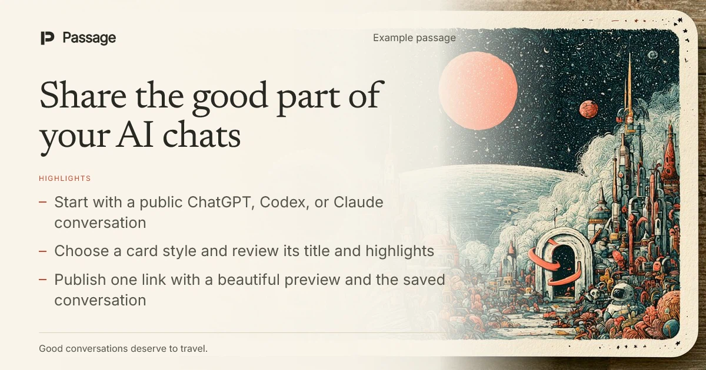
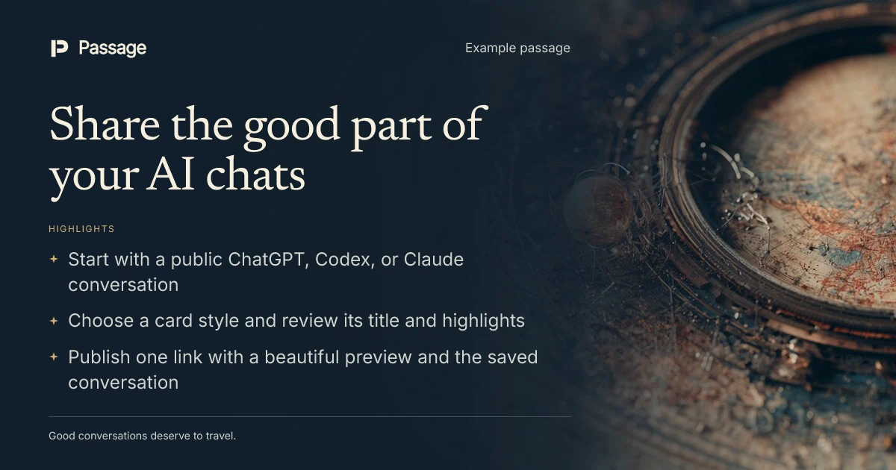

# Passage

**Your AI chats, worth sharing**

Turn your AI chats into links you’ll be proud to share

Give a public ChatGPT, Codex, or Claude conversation a clear introduction, a beautiful share card, and a readable saved conversation. No account needed.

[**Try Passage ↗**](https://www.share-ai-passage.com) · [Read an example](https://www.share-ai-passage.com/examples/share-your-ai-chats) · [Run locally](contributing.md#run-locally)

1. Paste a public conversation link and choose **Create a passage**.
2. Edit the generated title and highlights, then choose from **five card styles**.
3. Select **Publish passage** and share your passage link.

## Example passages

**Why the test passed locally but failed in CI.** A save request, a shared test record, and two useful next steps—enough context to decide whether to open the conversation.

One illustrative conversation, two ways to share it. Select a card to read the conversation behind it.

[](https://www.share-ai-passage.com/examples/share-your-ai-chats)

[](https://www.share-ai-passage.com/examples/share-your-ai-chats-after-dark)

## For agents

Install the [passage-share agent skill](.agents/skills/passage-share/SKILL.md) with the [skills CLI](https://skills.sh):

```sh
npx skills add transitive-bullshit/share-ai-passage --skill passage-share
```

Then ask your agent: “Use passage-share to create a passage from this public conversation: <public-conversation-url>.” It prepares a title and highlights, shows the preview, and publishes when authorized.

Requires Node.js 24+. The skill includes its CLI and uses the hosted Passage service. [Agent setup and local development](contributing.md#cli-and-agent-skill).

## Before you share

- **Start with a public link.** Use the provider’s Share option; private conversation addresses and workspace-only links aren’t supported.
- **The context comes with it.** Passages include saved conversation text, supported formatting and code, and the original-source link. Unsupported media, tools, and artifacts are marked as omissions.
- **Review before publishing.** Published wording and style stay fixed. Public passages can appear in search results.
- **Removal follows the source.** Remove public access at the provider, then use “Check original availability” in the passage reader. Confirmed removal disables the passage and card here. Checks are limited to once an hour; external platforms may retain previews they already fetched.

[Contributing](contributing.md) · [Brand identity](docs/brand-identity.md) · [MIT license](license)
