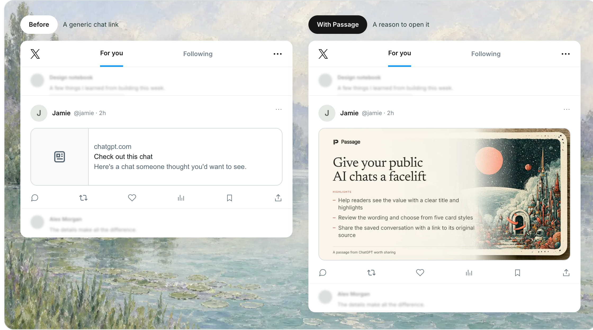

# Passage

**Your AI chats, worth sharing**

Turn your AI chats into links you’ll be proud to share.

[](https://www.share-ai-passage.com)

[**Try Passage**](https://www.share-ai-passage.com) · [View an example](https://www.share-ai-passage.com/chatgpt/89a0a919-ec9e-49a3-a966-67e5bff95e0e) · [Run locally](contributing.md#run-locally)

## Features

- Free
- Open source
- No account needed to create
- Optional accounts for saved drafts, history, and synced card styles
- Supports ChatGPT, Codex, and Claude

## For humans

1. Share an AI chat thread publicly from within your preferred AI app (or use this [public example](https://chatgpt.com/s/cx_6aa28dbe9be88191a1022960d8fa67c0)).
1. Paste the public chat link and select **Create a passage**.
1. Edit the generated title and highlights, then choose from the built-in **social card themes**.
1. Select **Publish passage** and share your new passage link anywhere you like.

## For agents

Install the [passage-share agent skill](.agents/skills/passage-share/SKILL.md) with the [skills CLI](https://skills.sh):

```sh
npx skills add transitive-bullshit/share-ai-passage --skill passage-share
```

Then ask your agent: “Use passage-share to create a passage from this public conversation: <public-conversation-url>.” It prepares a title and highlights, shows the preview, and publishes when authorized.

Requires Node.js 24+. The skill includes its CLI and uses the hosted Passage service. [Agent setup and local development](contributing.md#cli-and-agent-skill).

## How to share

- **Start with a public link.** Use the provider’s Share option; private conversation addresses and workspace-only links aren’t supported.
- **The context comes with it.** Passages include saved conversation text, supported formatting and code, and the original-source link. Unsupported media, tools, and artifacts are marked as omissions.
- **Review before publishing.** Published wording and style stay fixed. Public passages can appear in search results.
- **Manage your passages.** With an account, resume drafts, revise a passage into a new link, or delete your own links in My passages. Removing public access at the provider also disables affected passages once confirmed; external platforms may retain previews they already fetched.

[Contributing](contributing.md) · [Brand identity](docs/brand-identity.md) · [MIT license](license)
